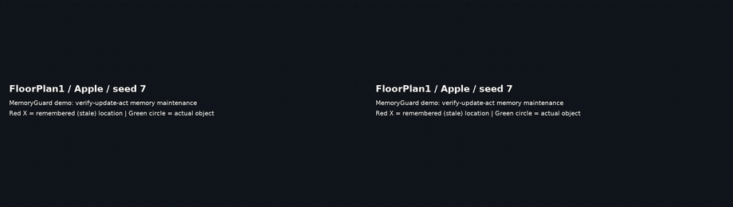
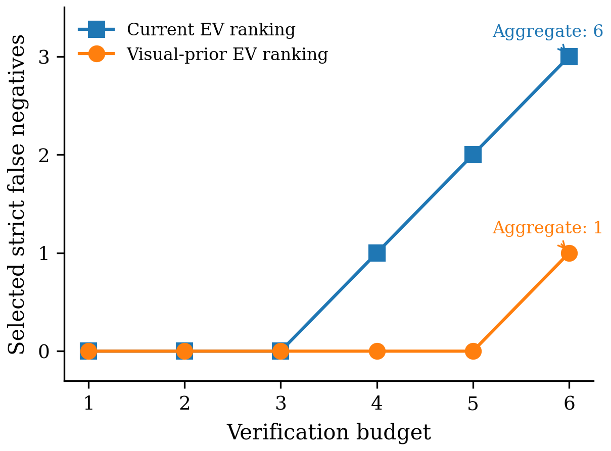
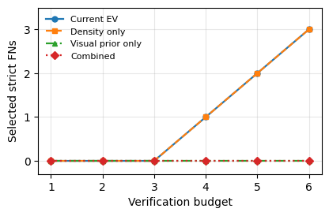
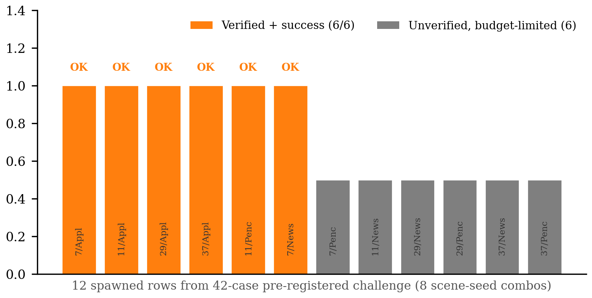

[English](README.md) | **简体中文**

# MemoryGuard

**面向长程具身智能体的有界主动记忆维护。**

[](https://github.com/Jxy-yxJ/MemoryGuard/actions/workflows/tests.yml)
[](LICENSE)

*江鑫宇（[@Jxy-yxJ](https://github.com/Jxy-yxJ)） — [项目主页](https://jxy-yxj.github.io/MemoryGuard/zh.html) · [代码仓库](https://github.com/Jxy-yxJ/MemoryGuard)*


MemoryGuard 研究长程具身记忆中的一个具体失效模式：环境变化后，记忆中某个物体的位置会悄悄变*陈旧*，
下游任务因为按过时记忆行动而失败。与其存入记忆后指望它一直有效，MemoryGuard 把记忆视为必须在**有界
预算下主动维护**的对象：在行动之前，它先判断某条记忆是否值得核验，用接地的感知/检测信号去核验，在陈
旧时刷新该记忆，然后才执行下游动作。

整体是一个简单的三阶段机制：

```
        核验              刷新              行动
记忆 ────────► 检测器 ────────► 更新 ────────► 下游任务
   ▲            (仅当             陈旧          (抓取 / 打开)
   │         期望价值 >                          
   └─────────── 预算) ◄────────── 有界重访预算
```

核验阶段是**检测器无关**的：任何陈旧信号都可接入（回放中的 oracle 元数据代理、实时运行中的
Grounded-SAM2 检测器，或视觉语言模型）。一个关键发现是：可靠的陈旧*检测*不等于可靠的记忆*维护*——
一个很强的视觉语言模型在 6/6 个案例上都能检出陈旧，却只在 3/6 上给出正确的更新决策。

## 工作原理

MemoryGuard 维护一组 `(类别, 位姿)` 对象记忆，并在其上运行一个有界的 **核验 → 更新 → 行动** 环。

**1. 打分——哪些记忆值得核验。** 在任何观测之前，每条记忆用廉价信号计算“期望核验价值”得分：
上次重访时目标是否可见、与记忆位姿的距离、以及按类别的视觉混淆指标（Book、Newspaper、Pencil
等易混淆类别）。在核验预算 `B` 下选出得分最高的 `B` 条。打分刻意保持简单、可审计，避免学习型
排序器干扰机制证据；整个环对信号不做假设，任何 `P(stale)` 估计器（包括基于视觉语言模型的）都可
替换它。

**2. 核验——有感知支撑的陈旧判定。** 逐步导航控制器走到记忆位姿（测量路径上不使用 `TeleportFull`）
并采集实时 RGB 帧；开放词汇检测器 Grounding DINO + SAM 2（“GSAM”）判断记忆中的物体是否仍在原处，
若已陈旧则给出由检测结果支撑的候选位置。Oracle 仿真元数据**仅**用于离线标签与案例构造，绝不作为
策略输入。

**3. 更新——由检测证据刷新记忆。** 当核验判定陈旧时，记忆记录被就地刷新：同时记录旧位置、新位置、
核验置信度与更新来源字符串，使每次记忆变更都可追溯。

**4. 行动——带守卫的诚实任务执行。** 智能体导航到刷新后的位置并尝试下游动作（`PickupObject`）。
交互是*诚实*的：`forceAction=False`（由仿真器强制距离与可见性约束）、修正偏航角后的“面向-抓取”
步骤、相机俯仰扫描（下 60°、上 30°），以及在首个位姿不可见时对最多三个邻近可达位姿的有界回退。

**可审计性。** 每一行都记录：是否使用核验器、陈旧判定、记忆是否被修改、重访/任务测量路径、
`TeleportFull`/`TeleportObject` 标志以及失败原因——任何结论都可追溯到具体决策。

### 评测协议

结论采用**配对**设计检验，而不是聚合成功率。案例先预注册，再经过与结果无关的几何筛选（陈旧记忆位置
与真实物体距离 ≥ 2 m、刷新位置 ≤ 1.5 m、目标可抓取、同类型配对无歧义）。随后主动与被动分支在**同一
批冻结案例**上运行，使用相同的场景/种子/初始摆放、相同的逐步导航与诚实交互；被动分支只按陈旧位置
行动，不使用核验器、不修改记忆。我们报告精确计数、McNemar 精确检验与 Clopper-Pearson 置信区间，
并在未见场景、目标类别与种子上做复现。

---

## 贡献

- **问题定义。** 把陈旧对象记忆视为*有界的主动维护*问题——在有限的感知/导航预算下决定哪些记忆值得
  核验——而不是被动的回放检测或 oracle 元数据核验。
- **与检测器无关的 verify–update–act 环**：预算有界、逐行可审计，并使用刻意简单的预核验排序信号，
  任何学习型 `P(stale)` 估计器都可替换。
- **诚实交互的配对评测协议**：预注册、几何筛选、主动/被动配对挑战，冻结案例列表、精确统计，并在
  未见案例上复现——其中包含首次诚实运行暴露出的朝向角缺陷的诊断与修复。
- **实证发现。** (i) 有感知支撑的主动维护能够与陈旧被动执行区分开（29/32 对 0/34；在未见案例上复现
  11/11 与 22/24）；(ii) 预算化排序把该易漏检协议上被选中的严格检测假阴性从 6 降到 1；(iii) 强视觉
  语言模型能检出陈旧（6/6）却无法完成维护（更新正确 3/6、完整链路 0/6）——检测不等于维护；
  (iv) 同类型实例混淆是主要核验错误模式（8/8 假阴性）且对运行条件敏感（非确定性复现）。
- **开放产物。** 预注册记录、冻结案例列表、逐行运行输出、分析代码与统计、演示视频均在本仓库中。

---

## 演示视频



*左：被动智能体按陈旧记忆行动，到达记忆中的旧位置（红 X）却一无所获。右：MemoryGuard 先核验记忆、
判定其陈旧、刷新位置，再导航到物体的真实新位置（绿圈）并完成抓取。视频由真实仿真帧渲染；完整分辨率
片段见 [`videos/`](videos/)。*

---

## 核心结果

| 结果 | 设置 | 数值 |
|---|---|---|
| **配对式 被动 vs 主动 挑战** | 预注册、几何筛选的 AI2-THOR 挑战（冻结 36 个案例 / 32 个可评估配对；修正后的交互协议） | 主动 verify–update–act **29/32（91%）**，实时被动陈旧记忆 **0/34**；McNemar 精确双侧 **p = 3.7e-09** |
| **Held-out 复现** | 未见过场景、目标类别与随机种子（11 例 pilot 与 24 例 v2） | 主动 **11/11** 对 被动 **0/11**（p = 9.8e-04）；主动 **22/24** 对 被动 **0/24**（p = 4.8e-07） |
| **实时闭环检测器** | 30 条控制器真实运行的行，使用实时 `InitialRandomSpawn`，不使用 `TeleportObject` | 与离线标签一致 **22/30**；20/30 条记忆被刷新；期望核验价值非均匀（均值 0.7287） |
| **逐步任务环（无传送捷径）** | 冻结的 6 案例混合挑战 | 自适应的、随路径长度缩放的行动预算，把下游 `PickupObject` 成功率从 **2/6 提升到 6/6** |
| **VLM 诊断基线** | Qwen3-VL-32B 基于原始前后帧 | 陈旧检测 **6/6**，正确更新 **3/6**；多轮智能体完成完整链路 **0/6** |

以上均为**固定挑战的机制性**结果，并附明确边界（见[适用范围与局限](#适用范围与局限)）；它们不是
大规模、ObjectNav/SPL 或操作基准层面的结论。

---

## 结果详解

### 1. 在预注册配对挑战上，主动维护优于被动保留

每个挑战案例都是几何筛选后的 AI2-THOR 重排配对：*被动* 智能体按陈旧记忆行动，会被迫走向一个很远
的错误位置（`d_passive >= 2.0m`）；而 *主动* 智能体通过核验与刷新，可以到达附近的正确位置
（`d_active <= 1.5m`）。全部 36 个合格案例在两个分支运行前就已冻结。

- **主动分支：** 32 个可评估配对中成功 29 个（91%）
- **实时被动分支：** 34 行中成功 0 个（诚实交互，`forceAction=False`）
- **配对精确检验：** McNemar 双侧 **p = 3.7e-09**；主动分支 95% Clopper-Pearson 置信区间 [0.75, 0.98]
- 有 2 条主动行不可评估（检测器漏检），另有 2 个冻结案例因仿真器崩溃丢失；均如实报告而非剔除。

**协议修正。** 最初的诚实交互版本使用了错误的偏航角公式，导致主动成功率被低估（22/34）。修正后的协议
改用正确的朝向计算，扩展了相机俯仰扫描范围，并为主动分支加入了有界的三候选位姿回退；旧的修正前数字
仅作为开发过程参考保留。

证据文件：`results/0514_corrected_interaction_v1/`、`results/0514_paired_hard_challenge_screen_v1/`。

### 2. 在未见场景/目标/种子上进行 held-out 复现

两个 held-out 挑战沿用同一冻结协议，但使用未见过的场景（不含 FloorPlan1/3/201）、未见过的目标类别
（不含 Apple/Book/Cup/Newspaper/Pencil）和未见过的随机种子。pilot 冻结 11 例；更大的 v2 在六个未见
场景、八个未见“场景-目标”组合上冻结 24 例，并使用已披露的更丰富的初始探测。

- **Held-out pilot：** 主动 **11/11**，被动 **0/11**（McNemar 精确 p = 9.8e-04）
- **Held-out v2：** 主动 **22/24（92%）**，被动 **0/24**（McNemar 精确 p = 4.8e-07；主动分支
  95% 置信区间 [0.73, 0.99]）
- 剩余 2 例主动失败是被遮挡的目标，即使启用位姿回退也始终不可见；均如实报告而非剔除。

证据文件：`results/0514_corrected_interaction_v1/holdout_v1_active/`、
`results/0514_corrected_interaction_v1/holdout_v2_active/`。

### 3. 实时、控制器驱动的闭环检测器

在 30 行的扫描中，策略侧唯一的陈旧检测器是运行在实时 `InitialRandomSpawn` 之后的 Grounded-SAM2 核验
器；oracle 元数据**仅**用于离线标签。检测器与离线标签的一致率为 **22/30 (0.7333)**，期望核验价值
非均匀，并且 20/30 条陈旧行触发了会话内的记忆刷新。

证据文件：`results/ai2thor_live_gsam_closed_loop_post_05822d3/`、
`results/ai2thor_live_gsam_closed_loop_compare/`。

### 4. 不依赖导航捷径的完整 verify–update–act 环

在冻结的 6 案例混合挑战上，一个自适应的、随路径长度缩放的行动预算，把逐步（不使用 `TeleportFull`）
的闭环从 2/6 提升到 **6/6** 次下游 `PickupObject` 成功，且行动前已用检测器证据刷新记忆。

证据文件：`results/ai2thor_live_gsam_mixed_challenge_budgetfix_v1/`、
`results/ai2thor_live_gsam_complete_closed_loop_seed29_apple_v1/`。

### 5. 检测不等于维护（VLM 基线）

一个视觉语言模型（Qwen3-VL-32B）仅凭原始帧就在全部 6 个混合挑战案例上正确判断了陈旧性，但在 3/6
上选错了更新方向——小物体/被遮挡物体因为从变化后的视角不可见而被判为“保留”。一个多轮 VLM 智能体
完成完整链路的比例为 0/6。这把*检测*与*维护*区分开来，也正是 verify–update–act 环的动机。

证据文件：`results/vlm_agent_multi_round_v1/`。

### 图表

| 预算 / 核验价值曲线 | 组件消融 | 混合挑战进展 |
|---|---|---|
|  |  |  |

---

## 仓库结构

```
embodied_memory_pilot/        # 核心库：基准、核验器、实时闭环运行器
  ai2thor_*.py                #   AI2-THOR 探测、重排基准、实时 GSAM 环
  *_verifier.py               #   oracle / MLP / CLIP / Grounded-SAM2 陈旧核验器
  maintenance / stress        #   主动维护策略与受控压力测试
tests/                        # 单元测试（核验器 schema、预算、诚实交互、筛选）
scripts/                      # 批量运行 / 分析 / 演示辅助脚本
  make_demo_video.py           #   渲染带字幕的双面板演示视频
  analyze_paired_hard_challenge.py  # 配对统计、精确检验、Clopper-Pearson 置信区间
figures/                      # 论文级图表（PNG）
videos/                       # 演示视频（mp4）与 README 动图
results/                      # 精选证据产物（JSON/CSV/MD + 部分帧图）
run_b3_remaining_seeds.sh     # 种子扫描的批量运行参考
```

## 复现

AI2-THOR 相关实验使用独立的 conda 环境。

```bash
conda create -n memoryguard-ai2thor python=3.11 -y
conda activate memoryguard-ai2thor
pip install -r requirements.txt     # 另需从上游仓库安装 Grounding DINO 与 SAM 2

# 单元测试
python -m unittest discover -s tests

# 实时 AI2-THOR 闭环检测器扫描（需要支持 GL 的显示，例如 Xvfb）
conda run -n memoryguard-ai2thor python -m embodied_memory_pilot.ai2thor_live_gsam_closed_loop \
    --out-dir results/ai2thor_live_gsam_closed_loop

# 配对式被动 vs 主动挑战：筛选、双臂运行、分析
conda run -n memoryguard-ai2thor python -m embodied_memory_pilot.ai2thor_paired_hard_challenge_screen \
    --scene-targets FloorPlan2:Egg FloorPlan5:Bread --seeds 101 103 107 --k 4 \
    --freeze-mode round_robin --probe-mode rich --out-dir results/screen

conda run -n memoryguard-ai2thor python -m embodied_memory_pilot.ai2thor_live_gsam_closed_loop \
    --scenes FloorPlan2 FloorPlan5 --seeds 101 103 107 \
    --case-list results/screen/case_list_paired_hard_challenge_frozen_v1.json \
    --verification-budget 4 --revisit-mode stepwise --execute-task-bridge \
    --honest-interaction --max-alternate-poses 3 --rich-before-probe --out-dir results/active

conda run -n memoryguard-ai2thor python -m embodied_memory_pilot.ai2thor_paired_task_bridge_control \
    results/active/live_gsam_closed_loop.json --live-passive --honest-interaction --out-dir results/paired

python scripts/analyze_paired_hard_challenge.py --active results/active/live_gsam_closed_loop.json \
    --paired results/paired/paired_task_bridge_control.json \
    --case-list results/screen/case_list_paired_hard_challenge_frozen_v1.json --out-dir results/analysis

# 为已记录的案例渲染演示视频
python scripts/make_demo_video.py --row-source results/active/live_gsam_closed_loop.json \
    --case FloorPlan2:Potato:101 --mode active --out-dir videos
```

## 适用范围与局限

本仓库刻意只给出**有界、可审计**的结论。特别地，它**不**主张：

- 超出该精确配对检验之外的大规模或统计稳健性；
- 完整导航成功率或 SPL（实时流水线部分环节使用 `TeleportFull` 作为有界重访捷径；逐步变体会被明确标注）；
- 超出本文所报固定挑战之外的操作基准性能或任务成功；
- 持久化记忆写回，或跨平台（Habitat/Gibson）迁移；
- 在冻结的几何筛选案例集之外的“主动优于被动”结论。

Oracle 仿真器元数据**仅**用于案例构造与离线评估——绝不作为策略输入、排序特征或可部署检测器。

## 引用

如果 MemoryGuard 对你的研究有帮助，请引用本仓库：

```bibtex
@misc{jiang2026memoryguard,
  title        = {MemoryGuard: Bounded Active Memory Maintenance for Long-Horizon Embodied Agents},
  author       = {Jiang, Xinyu},
  year         = {2026},
  howpublished = {\url{https://github.com/Jxy-yxJ/MemoryGuard}},
  note         = {Open-source research software}
}
```

## 作者

**Xinyu Jiang**（[@Jxy-yxJ](https://github.com/Jxy-yxJ)）
